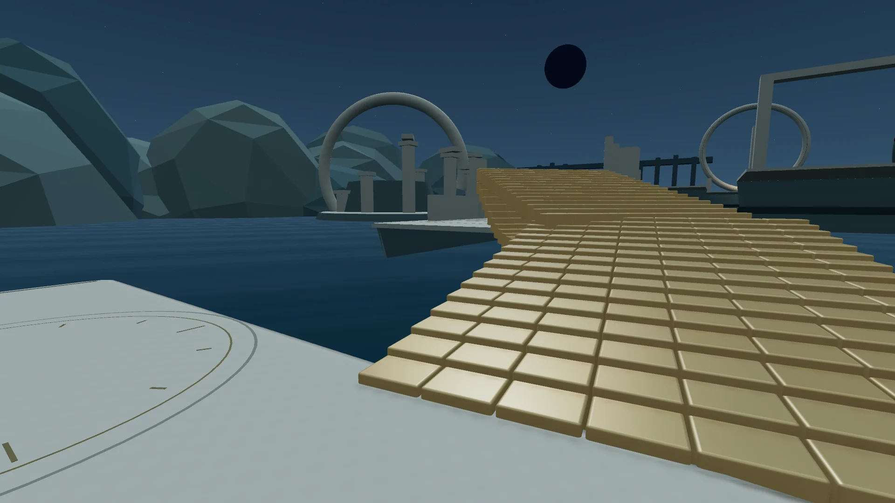

# Living Matter

Explore a flooded observatory with matter that builds paths from your movement, gaze and actions. Powered by real-time Jev intelligence.

[Play](https://livingmatter.vercel.app) · [How Jev works](docs/jev.md) · [Development](docs/development.md)



One body of 512 pieces becomes walking paths, climbs, descents, side exits and moving decks. Reach the circular monument or explore along the way. The surface beneath you stays in place while unused matter reshapes.

## Play

| Action | Desktop | Touch |
| --- | --- | --- |
| Move | WASD or arrow keys | Left stick |
| Look | Mouse or drag | Drag on the right |
| Jump | Space | Jump button |
| Sprint | Shift | Push the stick fully |
| Pause | Escape | Pause button |

Phones support portrait and landscape. Where supported, Play enters fullscreen; Exit fullscreen returns to the browser and pauses the game.

If Jev is unavailable, Preview keeps the game playable. Its brief notice can be dismissed.

## Run locally

Use Node.js 24 and pnpm:

```sh
git clone https://github.com/AKKI0511/living-matter.git
cd living-matter
pnpm install
pnpm dev
```

Open [localhost:3000](http://localhost:3000). Preview works without credentials. See [development](docs/development.md) for live Jev and testing, or [deployment](docs/deployment.md) to host your own instance.

Created by Akshat Joshi. Code is [MIT licensed](LICENSE); bundled asset notices are in [public/licenses](public/licenses).
