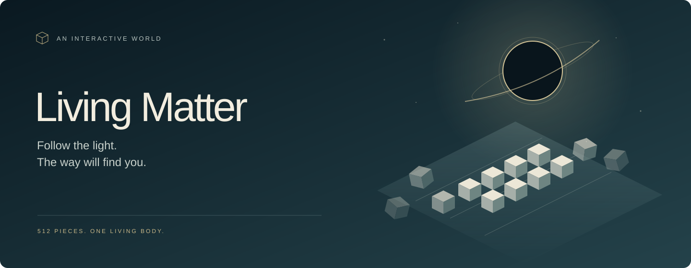

<p align="center">
  
</p>

<p align="center">A quiet 3D browser world. One living body. A path that moves with you.</p>

<p align="center">
  <a href="#play">Play locally</a> · <a href="docs/README.md">Explore the docs</a> · <a href="docs/jev.md">Meet Jev</a> · <a href="LICENSE">MIT</a>
</p>

Walk toward the light. Watch 512 pieces of matter gather into steps, bridges, and moving platforms. Turn around. Change your mind. See what follows.

Switch to night for a living black hole and a constellation drawn from your journey. Headphones recommended.

## Play

Use Node.js 24 and pnpm 12. No API key needed for preview mode.

```sh
git clone https://github.com/AKKI0511/living-matter.git
cd living-matter
pnpm install
pnpm dev
```

Open [localhost:3000](http://localhost:3000) and enter the world.

| Move | Look | Jump | Run | Pause | Day / night |
| :---: | :---: | :---: | :---: | :---: | :---: |
| WASD / arrows | Mouse / drag | Space | Shift | Esc | T |

On touch screens, use your left thumb to move, your right thumb to look, and the jump button.

## Play with Jev

Preview uses deterministic decisions. Live mode uses [Jev](https://docs.typesafe.ai/concepts/system-one), TypeSafe's System One model, to interpret your movement.

Create `.env.local` with:

```dotenv
NEXT_PUBLIC_DECISION_BACKEND=jev
TYPESAFE_API_KEY=your_api_key
TYPESAFE_DEFAULT_MODEL=jev-1.13.0
NEXT_PUBLIC_JEV_SESSION_AUDIT=0
```

Restart the dev server. Set the backend to `preview` to switch back. Live mode is experimental; [here is how it works](docs/jev.md). To record a play session during development, set `NEXT_PUBLIC_JEV_SESSION_AUDIT=1` and restart. Auditing defaults to off and is disabled in production. The ignored [Jev session audit](docs/jev-session-audits.md) can be found with `pnpm jev:sessions --latest`.

## Run a production build

```sh
pnpm build
pnpm start
```

Use a Node.js host with WebGL 2 in the browser. Set environment variables before building; keep the API key on the server.

---

[The experience](docs/experience.md) · [Architecture](docs/architecture.md) · [Development](docs/development.md)
