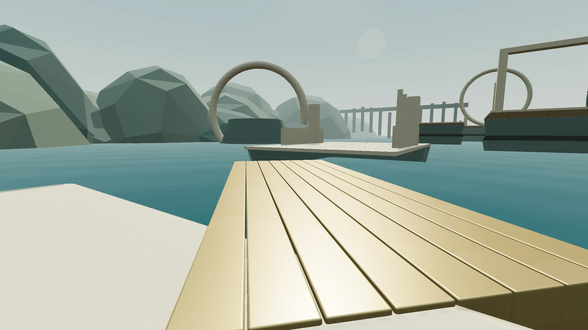

# Living Matter

Explore a world with a companion that builds paths as you move.

[Play Living Matter](https://living-matter-six.vercel.app) · [Roadmap](docs/roadmap.md)



Walk across limestone terraces, turn toward open water, climb or head back. One body of 512 pieces builds and recycles paths while keeping occupied support in place. Reach the circular monument, or take your time exploring.

## Play locally

Use Node 24 and pnpm.

```sh
pnpm install
pnpm dev
```

Open [localhost:3000](http://localhost:3000) and select Play.

WASD / arrows move. Mouse / drag looks. Space jumps. Shift runs. Escape pauses. T switches Day / Night. Touch uses a left movement stick, right look area and Jump button.

The menu offers Resume, Restart, Back to home, Sound and Auto / Low / High graphics. Interface mode defaults to Dark; Light is available. Preferences are saved locally.

## Decision modes

The default is deterministic preview, requiring no key. For live Jev, copy [`.env.example`](.env.example) to `.env.local`, set `NEXT_PUBLIC_DECISION_BACKEND=jev` and a server-only `TYPESAFE_API_KEY`, then restart. Live decisions hold existing support on provider failure and never silently switch to preview.

[Jev integration](docs/jev.md) · [Player–matter contract](docs/contract.md) · [Development](docs/development.md) · [Production configuration](docs/deployment.md) · [Roadmap](docs/roadmap.md)

```sh
pnpm typecheck
pnpm test
pnpm build
pnpm start
```

Project code and generated game art are [MIT licensed](LICENSE). Font licenses are in [public/licenses](public/licenses); renderer compatibility patches remain in [patches](patches).
