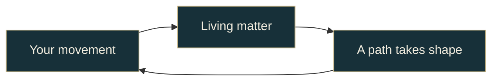

# Inside Living Matter

A browser game about moving through a world with matter that responds to you.

| Explore | What you will find |
| --- | --- |
| [The experience](experience.md) | The journey, formations, and a body that rebuilds as you walk |
| [Architecture](architecture.md) | World, decisions, physics, and rendering |
| [Jev](jev.md) | The exact role of AI, question batches, and decision rules |
| [Sessions](jev-session-audits.md) | Opt-in recording, offline replay and human-labeled eval data |
| [Development](development.md) | Run, verify, and extend the game |

[Play locally](../README.md#play)
