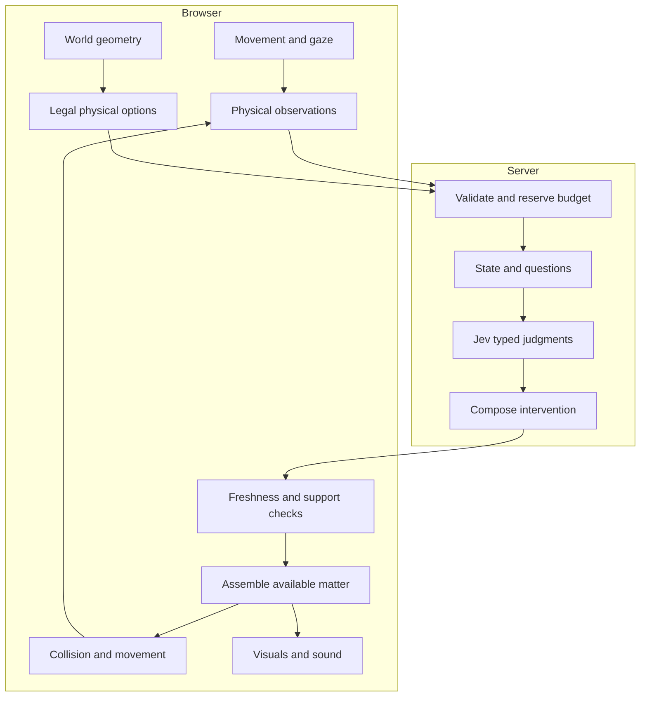

# Architecture

[How Jev works](jev.md) · [Development](development.md) · [Docs](README.md)

Living Matter combines an authored 3D world, a physical movement engine and a Jev intent interpreter. Code finds the paths that can exist. Jev chooses the contribution that fits the player's behavior. The runtime turns that choice into moving matter and usable support.

## Browser and server

Next.js serves a lightweight home at `/`. Entering `/play` mounts React Three Fiber, Three.js and Rapier. The run owns player input, observations, matter and asynchronous decisions; leaving the game disposes that run. The home page starts no simulation or inference.

The browser sends a bounded decision context to `/api/decision`. The server validates it, reserves a shared request budget, builds semantic state and calls the TypeSafe SDK. Credentials remain on the server. Only the composed intervention returns to ordinary gameplay.

Preview implements the same `DecisionSource` interface locally. Switching backends changes selection while retaining candidate generation, collision, assembly and support rules.

## Three independent rates

Rapier and the game simulation advance at **60 Hz**. Player observations are sampled at **5 Hz**, with meaningful behavior changes retained as history. Jev requests run asynchronously when the player needs a new contribution, subject to caching and cooldowns. Rendering interpolates the current simulation state at the display's frame rate.

A pending model response cannot stall movement or rendering. Auto / Low / High graphics change resolution, shadows and surface presentation; they never change the physical options or provider input.

## From a choice to a surface

The world describes shores, walkable ground, obstacles and formation dimensions. Candidate generation checks possible contributions against that geometry. During a weaving route, two 256-piece halves alternate between supporting the player and rebuilding.

When an answer arrives, the runtime checks that the player still wants the offered direction, the candidate is still usable and a half is free. It also checks clearance and current support. A stale answer is discarded. An accepted contribution animates into place and becomes walkable at its physical activation time. Rendering follows that execution state.

## Source map

| Responsibility | Source |
| --- | --- |
| World bounds, islands, obstacles and formation geometry | [world.ts](../src/game/world.ts) |
| Physically legal contributions | [affordances.ts](../src/game/affordances.ts), [weave.ts](../src/game/weave.ts) |
| Observations and readable behavior descriptions | [semantic.ts](../src/game/semantic.ts), [decision-state.ts](../src/game/decision-state.ts) |
| Replaceable selection interface and response gate | [decisions.ts](../src/game/decisions.ts), [decision-backend.ts](../src/game/decision-backend.ts) |
| Model questions and answer composition | [decision-request.ts](../src/server/decision-request.ts) |
| Server transport and shared budget | [decision route](../src/app/api/decision/route.ts), [decision-budget.ts](../src/server/decision-budget.ts) |
| Run lifecycle, execution and freshness | [runtime.ts](../src/game/runtime.ts), [Matter.tsx](../src/game/Matter.tsx), [decision-freshness.ts](../src/game/decision-freshness.ts) |
| Player movement and camera | [Player.tsx](../src/game/Player.tsx), [input.ts](../src/game/input.ts) |
| Matter, environment, quality and sound | [Matter.tsx](../src/game/Matter.tsx), [EnvironmentWorld.tsx](../src/game/EnvironmentWorld.tsx), [Scene.tsx](../src/game/Scene.tsx), [quality.ts](../src/game/quality.ts), [audio.ts](../src/game/audio.ts) |
| Menus and session settings | [Experience.tsx](../src/game/Experience.tsx), [store.ts](../src/game/store.ts) |

The [player–matter contract](contract.md) defines the invariants these layers share. The [Jev walkthrough](jev.md) shows a complete request and the resulting intervention.
