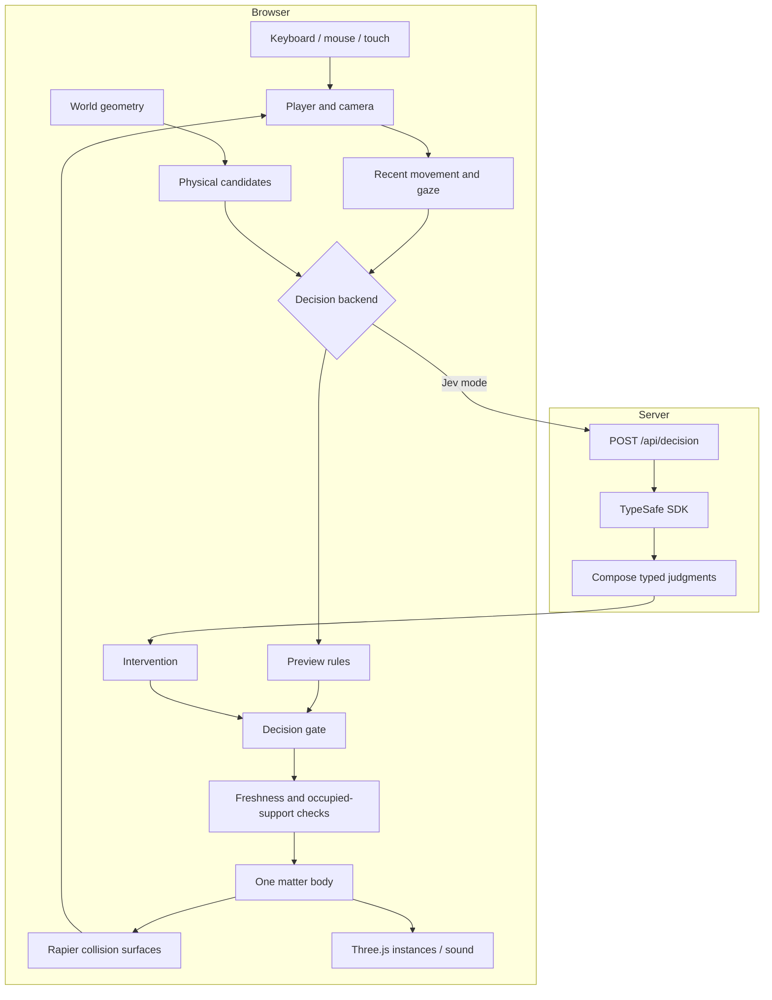
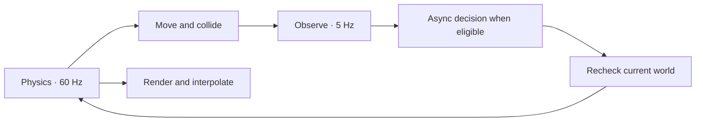
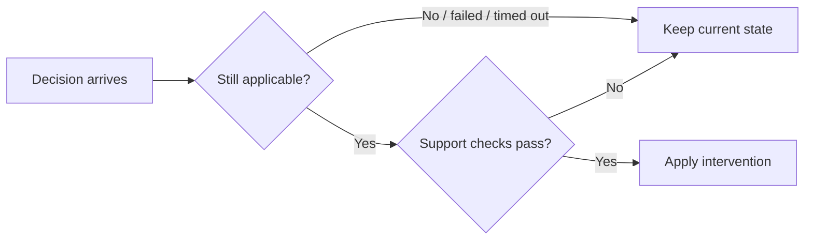

# From movement to matter

[Docs](README.md) · [The experience](experience.md) · [Jev](jev.md)

The world defines possible structures. A replaceable decision source chooses an intervention. The simulation checks that choice against the player's current position before changing matter.

## Keep each layer responsible for one thing

| Layer | Owns | Entry points |
| --- | --- | --- |
| World | Islands, crossing geometry, destination | [world.ts](../src/game/world.ts), [affordances.ts](../src/game/affordances.ts) |
| Decisions | Observation contract, backend selection, cancellation | [decisions.ts](../src/game/decisions.ts), [decision-backend.ts](../src/game/decision-backend.ts) |
| Matter | Transformations, section reuse, support checks | [Matter.tsx](../src/game/Matter.tsx), [weave.ts](../src/game/weave.ts) |
| Player | Movement, platform carry, camera, recovery, arrival | [Player.tsx](../src/game/Player.tsx) |
| Presentation | Lighting, sky, post-processing, synthesized audio | [Scene.tsx](../src/game/Scene.tsx), [audio.ts](../src/game/audio.ts) |
| Session | Pause, restart, settings, mutable simulation state | [store.ts](../src/game/store.ts), [runtime.ts](../src/game/runtime.ts) |

## Two clocks of work

Rendering and physics continue while a decision is pending. A single instanced mesh draws the 512 matter pieces; simplified collision surfaces support the player. Frame updates use mutable state rather than React renders.

Clear shore edges can launch routes anywhere within the shared world boundary. Only an unoccupied 256-piece half can rebuild. Side joins match the occupied surface's tilt, and solid obstacles constrain the offered steps before either backend selects one.

## A decision can expire

Candidate identity, world revision, player position, gaze changes, and occupied sections constrain execution. Restart cancels pending work. Neither backend controls the camera, collision solver, checkpoints, or completion rules.
