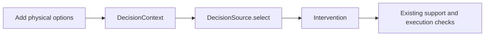

# Run and extend

[Docs](README.md) · [Architecture](architecture.md) · [Jev](jev.md)

Use Node.js 24 and pnpm 12. Exact versions are pinned in [`.node-version`](../.node-version) and [`package.json`](../package.json).

```sh
pnpm install
pnpm dev
```

Copy [`.env.example`](../.env.example) to `.env.local` to configure a backend. Restart development after a change. Production embeds `NEXT_PUBLIC_DECISION_BACKEND` at build time, so changing it requires a rebuild and matching server configuration.

```sh
pnpm build
pnpm start
```

Serve the app with Node.js. Jev mode requires the decision endpoint and a server-side key.

## Verify a change

```sh
pnpm typecheck
pnpm test
pnpm build
pnpm exec playwright install chromium
pnpm test:e2e
```

Local browser tests use Google Chrome. CI uses Playwright Chromium. Run gameplay tests in preview mode; SDK tests use mocked transport. To test an already-running production server, set `PLAYTEST_URL` to its URL and run:

```sh
pnpm exec playwright test production.spec.ts
```

CI uses the existing low-detail renderer (`NEXT_PUBLIC_RENDER_QUALITY=low`) with software graphics. This changes presentation only; movement and physics are identical. Default local play starts in high detail. Measure frame times locally with GPU acceleration rather than treating CI timings as GPU benchmarks.

Development exposes `window.__livingMatter` for snapshots, positioning, and formation checks. Production omits that interface.

## Add behavior without rebuilding the world



Extend geometry in `world.ts`, `affordances.ts`, and `weave.ts`. Extend selection through `DecisionSource`. Keep player controls, support checks, and progression in the engine. [AGENTS.md](../AGENTS.md) records the working conventions for coding agents.

## Dependency notes

| Dependency | Local compatibility work |
| --- | --- |
| React Three Fiber | Timer-backed clock adapter |
| Three.js | Axial PMREM sampling correction |
| N8AO | Explicit blur texture LOD |
| Drei | Reflection-buffer and blur-geometry disposal |
| Rapier | 0.20 override for current WASM initialization |

Patches are pinned in [`pnpm-workspace.yaml`](../pnpm-workspace.yaml). Recheck them when upgrading. Development Strict Mode is disabled because this renderer combination loses its WebGL context during the extra teardown cycle.

Project code is [MIT licensed](../LICENSE). Bundled fonts and the TypeSafe skill retain their licenses in [`public/licenses`](../public/licenses) and [`.agents/skills/typesafe-ai/LICENSE`](../.agents/skills/typesafe-ai/LICENSE).
