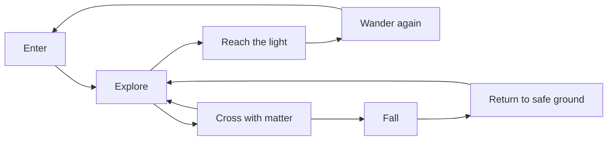
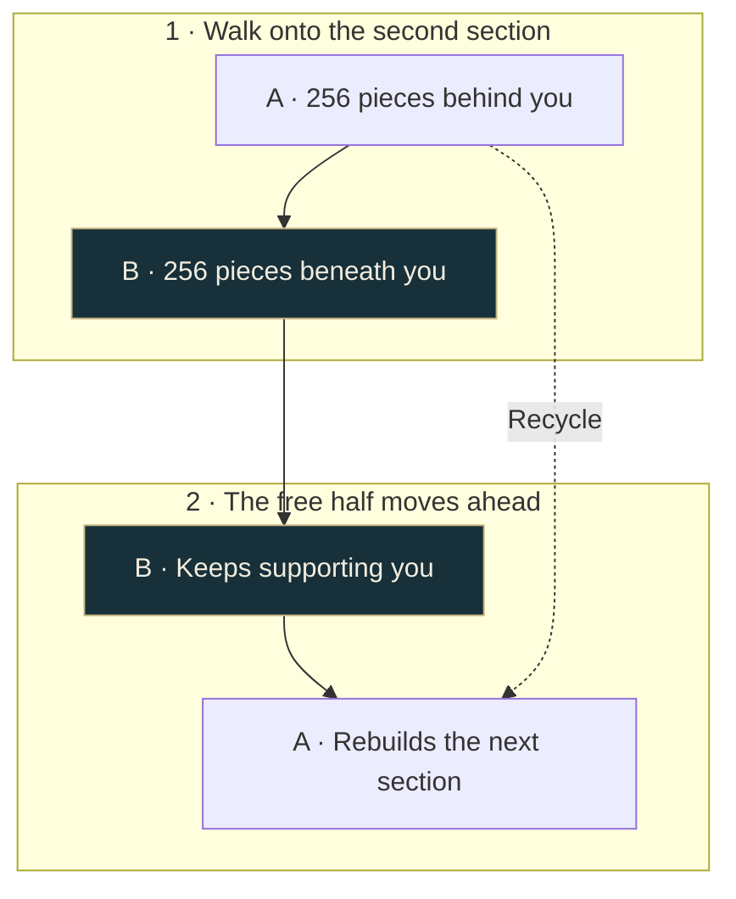

# A path that moves with you

[Docs](README.md) · [Architecture](architecture.md) · [Jev](jev.md)

Follow the illuminated destination across a small world of islands, water, and open air. Matter gathers nearby and offers a crossing. You can take it, hesitate, look elsewhere, or head back.

## One body, 512 pieces

The same matter travels between crossings. During a rolling route, two groups of 256 pieces take turns supporting you and rebuilding. A four-section crossing needs only two sections present at once.

As you cross, new choices can bend the route or change its height. Returning can rebuild sections behind you. Occupied support stays in place while the other half transforms.

| Shape | What it lets you do |
| --- | --- |
| Steps | Gain or lose height |
| Bridge or floating walkway | Walk across a gap or over water |
| Moving platform | Ride between shores while walking freely on deck |
| Rolling route | Chain sections together using the same two halves |

Ordinary play offers rolling routes and moving platforms. Individual whole-span formations are also available in the development harness.

## Try changing your mind

Walk toward a crossing, then turn away. Stop halfway. Look toward another route. Return to a shore you already visited. These actions give the decision backend fresh evidence about where you want to go.

Preview makes these choices with rules. Jev uses judgments about your recent behavior. Both act on the same physical options, within the same authored world.

Press **T** to change the light. At night, a constellation traces your route beneath the black hole. Audio, camera motion, and transformations give feedback while the screen stays mostly clear.
