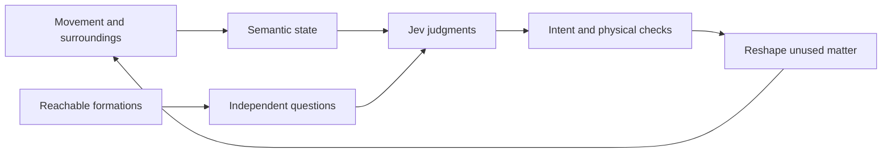

# How Jev reads movement

Jev interprets movement, gaze and recent actions to decide whether new walking space is wanted and which formation would help. It returns typed judgments; the game builds and validates the chosen surface.



## State: the scene in words

Jev receives text, with no screenshot or hidden knowledge of the world. Code translates geometry into facts such as a gap ahead, higher ground, or a view across the occupied walkway. State describes what is happening; questions define what to judge.

Directions follow the current view. On matter, `view_to_walkway` distinguishes looking along it, diagonally across it, or toward its side. Recent behavior keeps only the latest transitions. Earlier views and completed attempts cannot describe the current direction or requested height.

An example state for a held upward look at a gap:

```json
{
  "scene": "Separated ground above water; living matter reshapes into walkways or a moving deck.",
  "directions": "Current directions use current view; history uses earlier views. Heights compare walking surfaces.",
  "player_now": {
    "support": "formed material",
    "motion": "standing",
    "position_on_support": "at the surface edge",
    "facing_into": "gap without a continuous walking surface",
    "ground_across_gap": "higher solid ground",
    "view_height": "looking upward",
    "view_to_walkway": "along the walkway",
    "view_attention": "view held in the same direction"
  },
  "recent_behavior_oldest_to_newest": [
    {
      "support": "formed material",
      "motion": "standing",
      "position_on_support": "at the surface edge",
      "facing_into": "gap without a continuous walking surface"
    },
    {
      "support": "formed material",
      "motion": "walking forward",
      "position_on_support": "at the surface edge",
      "facing_into": "gap without a continuous walking surface"
    }
  ],
  "material_now": {
    "state": "ready to walk on or ride",
    "available_change": "Occupied support stays; unused material can reshape.",
    "continuation": "Continuation elsewhere or unobserved"
  }
}
```

Coordinates, measurements, timestamps and engine identifiers stay in code. Model-facing state and questions contain semantic text only; a guard rejects numeric data before inference. The API model selector and returned probabilities are separate from that scene description.

## Questions: intent and a useful formation

Questions share the state and run independently in the same request. A question cannot see another question's answer.

| Question | Primitive | Judgment |
| --- | --- | --- |
| `action_needed` | Noul | Does current behavior request new walking space? |
| `best_candidate` | Choice | Assuming a new route is wanted, which formation serves current direction and height? |
| `branch_intent` | Noul | Does movement or held view request departure from the occupied walkway? |
| `height_intent` | Noul | Does a deliberate upward or downward view near an edge request ascent or descent? |

The branch question is added at a matter edge or for a stopped, held view across it toward a gap. The height question is added for a sustained vertical look near an edge. Downward intent needs a deeper tilt, so looking at the walking surface does not repeatedly request descent.

The height question is:

```json
{
  "type": "noul",
  "instructions": "Does `player_now` indicate intent to ascend or descend?",
  "criteria": {
    "true": "Held upward/downward view at an edge toward a new route.",
    "false": "Surveying; brief glance; following a route already offered."
  }
}
```

Choice options describe formation, attachment, direction, view and movement alignment, height, shape and destination. A rise describes the next surface; destination height describes eventual ground. Safe shapes and slopes can change independently of the path already occupied.

This excerpt shows rising and level alternatives. The full menu includes the other physically available directions, heights and shapes:

```json
{
  "type": "choice",
  "instructions": {
    "question": "If new walking space is wanted, which formation best serves `player_now`?",
    "direction": "Current movement; held view while stopped. Current direction and height override history; shape or slope needn't continue.",
    "spatial_meaning": "vertical_change: next surface; destination_height: eventual ground.",
    "shared_option_facts": {
      "movement_alignment": "not moving horizontally",
      "next_surface_ends_at": "open gap"
    }
  },
  "criteria": {
    "option_m": {
      "formation": "walking path",
      "attachment": "end of existing walking surface",
      "starts_from": "ahead",
      "attachment_proximity": "nearby",
      "heading": "ahead",
      "view_alignment": "aligned",
      "vertical_change": "higher",
      "path_shape": "straight"
    },
    "option_l": {
      "formation": "walking path",
      "attachment": "end of existing walking surface",
      "starts_from": "ahead",
      "attachment_proximity": "nearby",
      "heading": "ahead",
      "view_alignment": "aligned",
      "vertical_change": "at similar height",
      "path_shape": "straight"
    },
    "none": "No formation fits intended direction and height."
  }
}
```

The engine preserves straight paths, curves, climbs, descents, side exits and rides when safe. Equivalent options share a label while retaining their physical attachments. Facts shared across options appear once; decorative support details stay out. Option order rotates across sessions and changed scenes to reduce a persistent first-option preference.

## From judgments to living matter

A Noul returns a yes/no probability. Choice returns a label, probabilities across the menu and confidence in their concentration. Confidence measures uncertainty, rather than proving that the player's intention was understood.

For the upward scene, the rising option can produce this answer excerpt:

```json
{
  "height_intent": { "type": "noul", "noul": 0.73 },
  "best_candidate": {
    "type": "choice",
    "choice": "option_m",
    "confidence": 0.95
  }
}
```

Code combines the intent judgments with the Choice. A credible climb or descent matching a positive height judgment can proceed even with level support ahead. A height judgment does not substitute another formation for Jev's actual selection.

Clear choices are preserved. When probability is spread over comparable useful alternatives, stable weighted variation keeps formations varied. Credible curves and turns remain selected; during movement, walking variety stays among walking routes rather than becoming a wait for a ride. Jev can still select a moving deck.

Before building, the engine checks current support, attachment, clearance and available matter. A level surface counts as already serving a route only when its height and extent match too. Occupied support stays intact; unused matter reshapes, and new surfaces catch landings during assembly. An occupied moving deck remains intact until shore.

Unchanged offers and continuous support avoid unnecessary calls. A new direction, deliberate height look or unresolved attempt can request another judgment. Physics and rendering continue while the model responds; obsolete or unsafe replies cannot apply. Provider failures temporarily use Preview through the same physical checks.

## Inspect and extend

[Record decisions](jev-session-audits.md) to compare state, answers and actual outcomes, and add human intent labels for evaluation. The core implementation is [semantic.ts](../src/game/semantic.ts), [decision-state.ts](../src/game/decision-state.ts) and [decision-request.ts](../src/server/decision-request.ts).

The method follows TypeSafe's [state guidance](https://docs.typesafe.ai/concepts/state), [Noul](https://docs.typesafe.ai/primitives/noul), [Choice](https://docs.typesafe.ai/primitives/choice) and [Jev prompting guidance](https://docs.typesafe.ai/model-jaggedness/jev-1.13).
