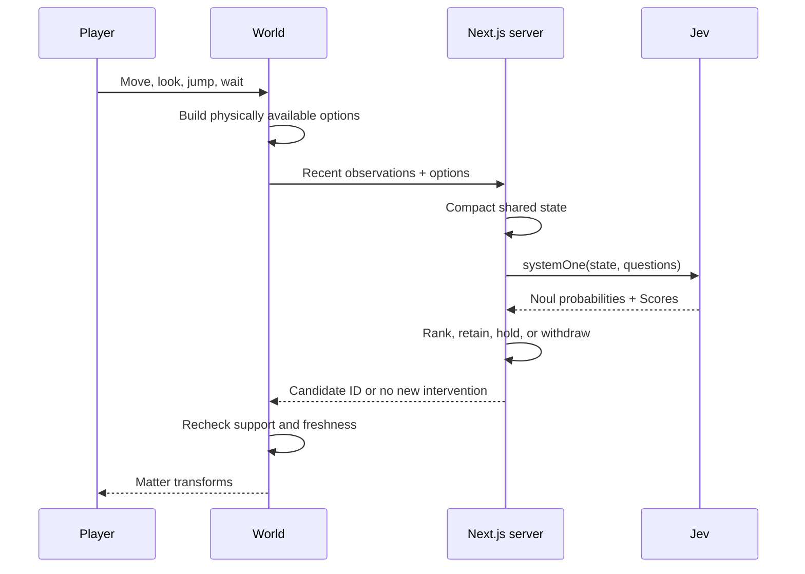
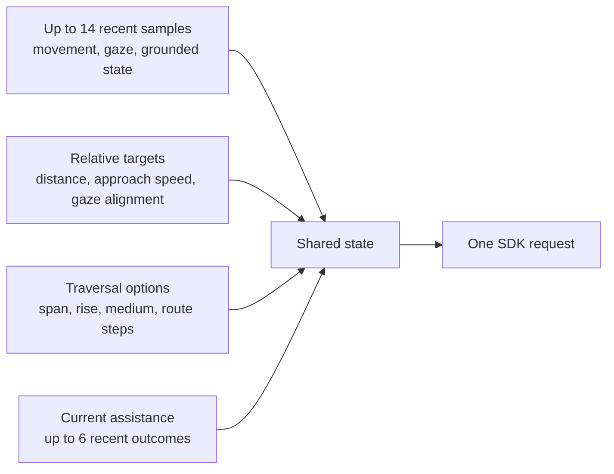

# How Jev moves the matter

[Docs](README.md) · [Architecture](architecture.md) · [Setup](../README.md#play-with-jev)

[Jev is TypeSafe's System One model](https://docs.typesafe.ai/concepts/system-one). Living Matter uses its typed judgments to interpret movement and choose among physical interventions. There is no chat interface or generated action script.

## One batch, several small questions



Questions use the [Noul](https://docs.typesafe.ai/primitives/noul) and [Score](https://docs.typesafe.ai/primitives/score) primitives. Each question addresses one judgment; code combines the answers.

| Question | Primitive | Used for |
| --- | --- | --- |
| Is the player trying to reach this destination? | Noul, per distinct target | Destination intent probability |
| Does this traversal mode fit their movement? | Score, per option | Graded fit from 0 to 3 |
| Are they changing their travel goal? | Noul | Shorter or longer cache lifetime |
| Have they abandoned the current assistance? | Noul, when assistance exists | Explicit withdrawal when no option qualifies |

## What the model receives



The server computes distances and alignments, rounds measurements, and groups options that share a destination. Stage names and stage order are absent from the model's state. The payload contains game observations, without screenshots, microphone input, or dialogue.

## Code turns judgments into a choice

An option qualifies when target probability is at least **0.60** and normalized fit is at least **0.45**. Its rank is:

```text
fit  = Score / 3
rank = 0.70 × target probability + 0.30 × fit
```

The current option stays selected when it qualifies and trails the best rank by less than **0.10**. Exact ties prefer a rolling route. If nothing qualifies, existing assistance is held unless abandonment probability reaches **0.80**. The engine still protects occupied support.

These are initial playtest thresholds, defined in [decisionPolicy](../src/server/decision-request.ts). Model confidence is logged for diagnosis; it does not establish physical safety.

## Calls follow decisions, not frames

| Control | Current behavior |
| --- | --- |
| Batching | Shared state sent once for all independent questions |
| Reuse | Unchanged request signatures reuse a result for 1.5 or 6 seconds |
| Pacing | At least 1.5 seconds between browser requests; failures back off |
| Deadline | SDK timeout of 1.6 seconds; decision gate deadline of 2 seconds |
| Server budget | At most 4 in flight and 120 requests per minute, per process |

The API key stays in the Node.js server. Development logs include model, token usage, judgments, and the composed decision. Failures hold the current state; live mode does not silently switch to preview.

## The current boundary

Jev chooses from routes and formations supplied by the engine, including continuations while the player is already crossing. It does not invent arbitrary geometry or plan an unrestricted world. The authored world and candidate generator define its available actions.

The integration has SDK tests with mocked transport. Live model behavior and thresholds still need playtesting. For an internet-facing live deployment, add authentication and a shared request budget; the current process-local limits do not enforce an account-wide spending cap.

| Change | Where |
| --- | --- |
| Questions, state, decision policy | [decision-request.ts](../src/server/decision-request.ts) |
| SDK call, credentials, server limits | [API route](../src/app/api/decision/route.ts) |
| Backend toggle, caching, backoff | [decision-backend.ts](../src/game/decision-backend.ts) |
| Contract and cancellation | [decisions.ts](../src/game/decisions.ts) |
